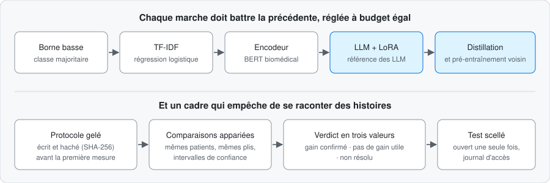

# LLM_finetuning

**Un LLM affiné bat-il vraiment un TF-IDF bien réglé ? Et de combien ?**
Un protocole pour le savoir sans se raconter d'histoires, sur une seule carte graphique (RTX 5090).

Tâche : prédire le chapitre CIM-10 d'un séjour à partir de ses comptes rendus en français.
Données : PARHAF, corpus ouvert de comptes rendus **fictifs** (CC BY 4.0). Aucune donnée de patient réel.

> **Vitrine.** Le code et les preuves de chaque run sont dans un dépôt privé.
> La présentation détaillée (diapositives, protocole, résultats et leurs preuves) est envoyée **sur demande** :
> [cyril.bgs.dev@gmail.com](mailto:cyril.bgs.dev@gmail.com?subject=LLM_finetuning%20%3A%20demande%20de%20pr%C3%A9sentation)

## Pourquoi ce projet

La plupart des comparaisons de techniques d'adaptation (LoRA, distillation, pré-entraînement voisin) se
perdent dans les mêmes pièges : référence faible ou mal réglée, test réutilisé, gain annoncé sans
intervalle de confiance. Ici, la règle est inverse : **les références sont fortes, le protocole est
écrit avant de mesurer, et « non résolu » est un verdict honorable.** Si aucune technique ne l'emporte,
le livrable est un résultat négatif reproductible.

## Ce que les premières mesures ont déjà montré

Sans chiffres sur cette page (ils se lisent avec leurs intervalles dans la présentation détaillée) :

1. **La référence est la moitié du travail.** Un TF-IDF correctement réglé est une barre haute : avec
   la recette gelée au départ, aucun LLM affiné ne la franchissait.
2. **Cette conclusion était fausse.** La recette d'entraînement, trop courte, sous-estimait tous les
   modèles appris. Allongée, le LoRA passe devant sur les deux plis mesurés (exploratoire, une graine par
   pli). Le protocole a été corrigé par version, l'erreur est consignée, pas effacée.
3. **Le score dépend du découpage.** Découper par patient ou par auteur change le résultat d'un écart supérieur
   à l'incertitude de mesure. Les deux valeurs sont rapportées, trois explications posées, aucune tranchée
   sans preuve.
4. **Le seuil d'utilité était trop fin pour le budget.** La puissance, simulée avant les entraînements, le
   prédisait : le premier cycle est donc classé *exploratoire*, et aucun gain n'est annoncé sans verdict.

## Où en est le projet (5 octobre 2026)

Premier cycle exploratoire terminé, des références aux LLM affinés, avec calibration, abstention,
robustesse et coûts mesurés. **Aucun verdict confirmatoire n'est rendu.** Il viendra d'un second cycle
sous protocole révisé (plusieurs plis, plusieurs graines), puis d'une ouverture unique du test scellé.
La distillation reste à comparer dans ce cadre.

## Comment c'est construit

Une seule personne et des agents de code (Claude Code, Codex) sous un contrat écrit : décisions et erreurs
datées dans un journal, aucune affirmation publiée sans sa preuve, audits croisés par d'autres modèles
puis vérifiés à la source.
Python · PyTorch · Hugging Face (Transformers, PEFT, TRL) · scikit-learn · pytest · mypy strict · uv · Docker

---
Cyril Bourgeois, Data Scientist et ingénieur ML ·
[Portfolio](https://cyril-bgs-dev-tech.github.io/Portfolio/) ·
[LinkedIn](https://www.linkedin.com/in/cyril-bourgeois-65a739150) ·
[Kaggle](https://www.kaggle.com/cyrilbourgeois)
